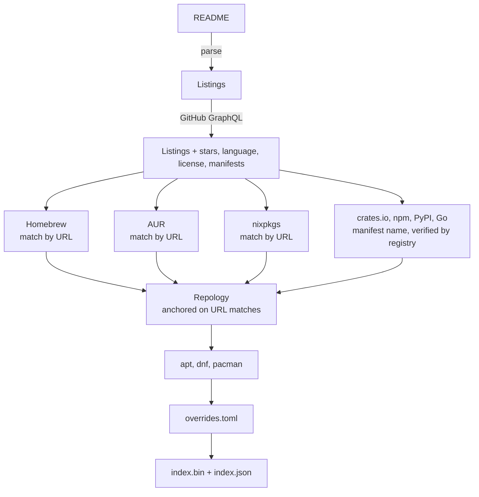
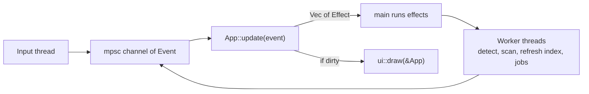

# Architecture

<!--toc:start-->
- [Architecture](#architecture)
  - [Crates](#crates)
  - [Index format (`tuiman-index`)](#index-format-tuiman-index)
  - [Indexer (`tuiman-indexer`)](#indexer-tuiman-indexer)
  - [Client (`tuiman`)](#client-tuiman)
    - [Running interactive commands](#running-interactive-commands)
  - [Security](#security)
  - [Not supported in v1](#not-supported-in-v1)
<!--toc:end-->

## Crates

| Crate | Purpose |
|---|---|
| `crates/tuiman-index` | Catalog type and binary index format. No dependencies. Used by both other crates. |
| `crates/tuiman-indexer` | Builds the index. Runs daily in CI (`.github/workflows/index.yml`), not shipped to users. |
| `crates/tuiman` | The client (TUI and CLI). |

The indexer does the slow work (GitHub API, package registries). The client
only downloads and reads the resulting index file.

## Index format (`tuiman-index`)

`Catalog` is stored column-wise: one `Vec` per field (`stars: Vec<u32>`,
`category: Vec<u8>`, ...) plus a single `String` arena that text fields point
into as `(offset, len)`. Languages, licenses and categories are interned.
Packages are a flat column; each row's packages are found via `pkg_start`.

On disk it is a header followed by the columns in little-endian. The layout
is documented in `format.rs`.

`decode`:

1. Computes the expected length from the header and rejects the input if it
   does not match, before allocating.
2. Validates every range, id, URL and package name.

After decoding, accessors index without bounds checks. Tests cover truncation
at every length and corruption of every byte.

Compatibility: unknown ecosystem ids are skipped, so older clients can read
indexes that contain new ecosystems. Breaking changes bump the format version,
and older clients then ask the user to update.

## Indexer (`tuiman-indexer`)

Packages are never matched by name alone:

- **Homebrew, AUR, nixpkgs**: these publish an upstream URL per package.
  Matched on GitHub `owner/name`.
- **crates.io, npm, PyPI, Go**: the package name is read from the manifest in
  the repository root and accepted only if the registry entry links back to
  the same repository.
- **apt, dnf, pacman**: via Repology, whose API has no URLs. A Repology
  project is accepted only if it contains a package already matched by URL in
  the step above.

`overrides.toml` holds manual corrections applied last.

Failure handling:

- Each source is optional. If one is unavailable, that ecosystem is missing
  from the day's index.
- The run fails if the README yields fewer than 400 entries (`MIN_ENTRIES`).
- The output is decoded once before being written.

## Client (`tuiman`)

The main loop blocks on the channel and redraws only when `App::dirty` is set.
A timer tick runs only while a spinner is visible. Startup reads the cached
index and installed-state cache and draws; everything that can block (`PATH`
scan, package managers, HTTP) runs on worker threads.

| File | Role |
|---|---|
| `app.rs` | State and the `update` transition function. No I/O, so interactions are unit-tested directly. |
| `main.rs` | Terminal setup, event channel, threads, running effects. |
| `ui/` | Rendering from `&App`. |
| `query.rs` | Filtering, fuzzy matching (nucleo) and sorting into a reusable view (`Vec<u32>` of row ids). |
| `managers/` | Static table of package managers. Per-manager behaviour is a function pointer in the table row. |
| `installed.rs` | Builds two bitmasks per row (available / installed) and caches them for the next start. |
| `fetch.rs` | Conditional GET of the index, validates it, then atomically replaces the cached file. A failed download leaves the cache unchanged. |
| `trace.rs` | `TUIMAN_TRACE=1` prints startup phase and frame timings on exit. |

Performance targets: first frame under 20 ms with a warm cache, keypress to
frame under 5 ms, query over the full catalog under 1 ms.

### Running interactive commands

apt, dnf, pacman and AUR helpers may prompt for passwords or confirmation, so
they run in the real terminal: tuiman leaves the alternate screen, runs the
command with inherited stdio, then restores the UI.

The input thread must not read the tty during this, or it would consume the
sudo password. `term::Input::pause` blocks until the input thread has
released the tty. To support this, the input thread wakes every 250 ms to
check for a pause request.

## Security

- Commands are built as argument vectors and never passed through a shell.
- Package names must match `[A-Za-z0-9@._+/-]+` and must not start with `-`.
  Checked by the indexer, by `decode`, and asserted where commands are built.
- URLs must be `http` or `https` before being opened in a browser.
- Control characters and escape sequences are stripped from catalog text and
  job output before drawing.
- The index is fetched over HTTPS only and limited to 16 MiB
  (`MAX_INDEX_BYTES`).
- The full command is shown and must be confirmed before it runs.

## Not supported in v1

- Windows
- Installing from GitHub release assets
- Detecting TUIs installed outside a package manager
- Configuration and theming
